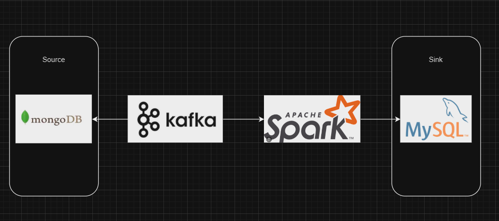
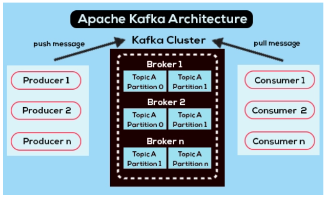

# 1. Vấn đề đặt ra
Khách hàng muốn một pipeline xử lý MongoDB sang MySQL. Trong đó làm sao phải xử lý nhận biết được sự thay đổi trong DB ban đầu để tiến hành các thay đổi trong target.
Yêu cầu đặt ra là công nghệ có ứng dụng xử lý realtime.
# 2. Các công nghệ sử dụng
* MongoDB
* MySQL
* Kafka
* Pyspark

# 2. Pipeline cơ bản


Như bài toán đặt ra, ta có các công nghệ chính như hình. Ở đây còn một concept khác chính là môi trường, docker sẽ nơi lý tưởng để tạo ra các hệ thống phân tán như Kubernetes,docker swarm hay hadoop.
Như ta thấy, mongodb sẽ đóng vai trò như data nguồn, MySQL như data đích. 

Tuy nhiên, để có sự thao tác giữa hai db này, ta phải có một compute engine. Spark sẽ đóng vài trò như cỗ máy tính toán thực thi các query và deliver data từ nơi này tới nơi khác.

Ngoài ra, bài toán còn đặt ra một vấn đề chính là model phải realtime. Kafka sẽ đóng vai trò như message, đồng thời chính là CDC để thông báo sự kiện, sự thay đổi cho spark biết.
Từ đó mô hình sẽ được cập nhật theo thời gian 
# 3. Download
### a. Mongo
```
Đây là CSDL NoSQL, trong project, nó đóng vai trò như Data nguồn
Link tham khảo cấu hình trên docker
https://hub.docker.com/_/mongo
https://geshan.com.np/blog/2023/03/mongodb-docker-compose/

docker run -d --name mongodb -p 27017:27017 mongo 
```

## b. MySQL
```
Đây là target DB, là Structure Data.
Như trên, ta có thể vào trang sau để tham khảo cấu hình
https://hub.docker.com/_/mysql

docker exec -it my-sql /bin/bash
```

## c. Kafka
```
Link tham khảo
https://hub.docker.com/r/bitnami/kafka

docker exec -it my-sql /bin/bash
```



Để cấu hình kafka, ta phải cấu hình thêm Zookeeper.
Thành phần này sẽ đóng vai trò như cỗ máy phân dữ liệu vào các consumer. 
Các consumer ở đây như nơi lấy data nhận để gửi đi. 
Ngoài ra còn một định nghĩa nữa nằm trong docker, đó là broker, nó như vài trò cầu nối giữa nơi nhận và nơi gửi, trong đây, data lưu và chia nhỏ nhành các partition, điều này giúp đảm bảo giữ được data khi gặp sự cố
## d. Pyspark
Đây là compute engine
Link tham khảo
https://medium.com/@mehmood9501/using-apache-spark-docker-containers-to-run-pyspark-programs-using-spark-submit-afd6da480e0f

Ở đây, ta cài đặt đơn giản bằng cách dùng library trong python.
